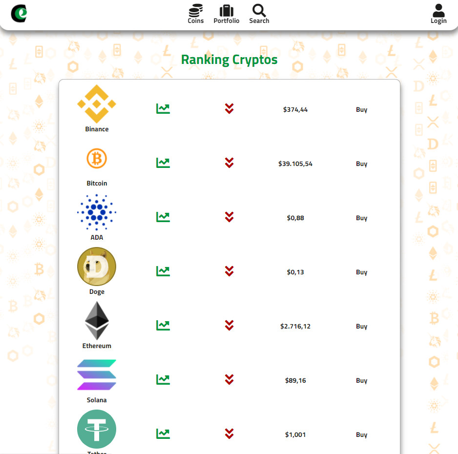

# E-Crypt: Mercado de Criptomonedas

Proyecto creado utilizando React (Javascript) como front-end y Firebase como back-end. El objetivo de la aplicación consiste en brindar a los usuarios la capacidad de poder observar, comprar y vender todo tipo de criptomonedas, incluyendo la capacidad de realizar transacciones utilizando métodos modernos de pago como lo es una "crypto-wallet".



## Link

El proyecto puede ser accesado a través del siguiente [link a Heroku](https://ecrypt-nc-g63.herokuapp.com/)

## Equipo
Eduardo Arevalo: Front End 
- [Linkedin](https://www.linkedin.com/in/eduardo-arevalo-/)
- [GithUb](https://github.com/Edu568)

Tomás Kleinschuster: Front End
- [Linkedin](https://www.linkedin.com/in/kleinschuster-tomas/)
- [Github](https://github.com/TomasKleinschuster)

Eduardo Santizo: Full Stack
- [Linkedin](https://gt.linkedin.com/in/eduardo-santizo-olivet-81b802139)
- [Github](https://github.com/eddysanoli)

Guido Greco: Front End
- [Linkedin](https://www.linkedin.com/in/guido-greco14)
- [Github](https://github.com/malks14)

Arleys Manzanares Gatica: FrontEnd
- [Linkedin](https://www.linkedin.com/in/arleys-gatica16/)
- [Github](https://github.com/ArleysGatica)


## Estructura de Carpetas

```bash
No Country - Cohorte 3 - ECrypt
|
├─ readme-assets: Imágenes y elementos en Readme
├─ Procfile: Archivo usado por Heroku para el deployment
|
├─ public: Elementos estáticos
│  ├─ favicon.ico
│  ├─ index.html
│  └─ robots.txt
|
├─ README.md
|
├─ server: Archivos para servidor estático usado en build de producción
│  └─ server.js
|
└─ src: Código fuente para la aplicación
   |
   ├─ App
   │  ├─ components
   │  │  ├─ Acreditar
   │  │  ├─ CardCheckout
   │  │  ├─ Checkout
   │  │  ├─ Header
   │  │  ├─ Layout
   │  │  ├─ Login
   │  │  ├─ Moneda
   │  │  ├─ Order
   │  │  ├─ SignIn
   │  │  ├─ SignUp
   │  │  └─ TablaRegistro.jsx
   |  |
   │  ├─ Home
   │  ├─ noticias
   │  ├─ Page
   |  |
   │  └─ Routes: Diferentes rutas disponibles en la aplicación
   │     └─ Index-Router.js
   |
   ├─ Assets
   │  ├─ fondo.png
   │  ├─ Frame.png
   │  └─ Vector.png
   |
   ├─ Components
   │  ├─ api
   │  │  └─ apicrypto.js
   │  └─ UI
   |
   ├─ firebase.js: Scripts relacionados con conexión a Firebase
   ├─ helper
   │  └─ chart.js
   |
   ├─ Images
   |
   ├─ index.css
   ├─ index.js
   |
   ├─ Pages
   │  └─ Wallet
   │     ├─ WalletPage.js
   │     └─ WalletPage.module.css
   |
   └─ store
      └─ auth-context.js
```

## Deployment (Heroku)

1. Moverse a la carpeta del proyecto `cd "CARPETA-PROYECTO"`
2. Crear una cuenta de [Heroku](https://id.heroku.com/login) e instalar el Heroku CLI (Command Line Interface).
3. Ingresar a Heroku desde la consola: `heroku login`
4. Asegurarse de que exista un repo adentro de la carpeta de proyecto. En caso que no exista, inicializar el repo dentro de la misma carpeta en la que está el archivo `package.json`: `git init`
5. Crear un proyecto dentro de Heroku (El nombre no es único para el usuario, sino para todos los usuarios de Heroku, por lo que puede que ya esté tomado): `heroku create APPNAME`
6. Para corroborar que funciona se puede abrir la nueva app: `heroku open -a APPNAME`
7. Se agrega el nuevo remoto de Heroku al repositorio local: `heroku git:remote -a APPNAME`
8. Instalar express: `npm install express --save`.
9. Crear un archivo para el servidor dentro de la carpeta `server`. [Utilizar express para crear un servidor estático](https://betterprogramming.pub/how-to-deploy-your-react-app-to-heroku-aedc28b218ae).
10. Crear un "production build" de la aplicación: `npm run build`.
11. Crear un Procfile, para indicarle a Heroku el comando a correr para hacer correr nuestro servidor estático.
12. Configurar las variables de entorno adentro del archivo `.env` dentro de Heroku: `heroku config:set VARIABLE_NAME=value`
13. "Pushear" los cambios de rama actual a Heroku: `git push heroku RAMA-A-SUBIR:main`
14. Abrir la aplicación: `heroku open`

----

## Probando Aplicación

El proceso de probado de la aplicación se puede realizar de dos maneras distintas dependiendo de si se trata de un "build" para desarrollo o de un "build" de producción.

### Desarrollo

- Utilizar el comando `npm start`. Esto iniciará un servidor de desarrollo dentro de la ruta [http://localhost:3000](http://localhost:3000).

### Producción

- Crear un "build" de producción utilizando `npm run build`. Esto une todos los archivos de javascript, css y html, para que sea mucho más eficiente presentarlos al momento de que un servidor los requiera.
- Probar el nuevo build del servidor utilizando `node server/server.js`. Esto abrirá un servidor estático utilizando express.
- Si el sitio funciona correctamente, puede realizarse un merge request al `master`. Cuando se haga el merge, heroku automáticamente realizará un nuevo deploy de la aplicación. Luego de aproximadamente 5 minutos, los cambios podrán observarse.
